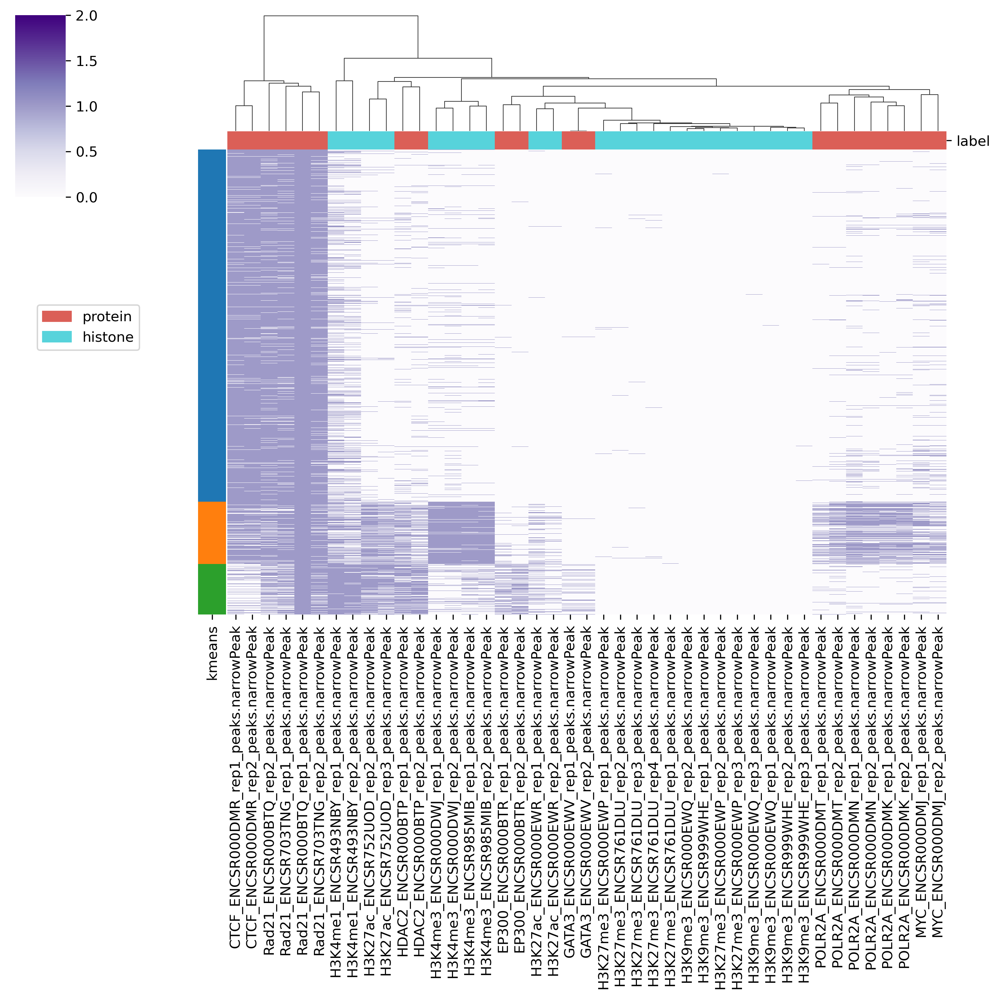

Peakheatmap: Large-scale profile analysis
=================================================

**Churros** provides commands for clustering and visualizing large-scale peak profiles.
These functions take a reference region (BED format) and cluster regions based on the overlap pattern of peaks or bigWig profiles.
The sample scripts are also available at `Churros GitHub site <https://github.com/rnakato/Churros/tree/main/tutorial/06.peakheatmap>`_.

peakheatmap_binary: Binary comparison
--------------------------------------------------------------------

``peakheatmap_binary`` outputs a binary matrix (output 1) representing the peak overlap for given genomic regions. The binary matrix is then formatted and sorted by the user-defined column (i.e., the filename of the selected marker) to generate the processed matrix (output 2) and plot the sorted heatmap (output 3). It then utilizes PCA followed by k-means clustering (or other clustering methods) to produce the clustered matrix (output 4) and the clustered heatmap (output 5).

The main usages are:

.. code-block:: bash

   peakheatmap_binary <region> <directory>

The required parameters:

   - ``region``: a BED file for regions of interest. Only the first 3 columns are used.
   - ``directory``: a directory containing the peak files.

The optional parameters:

   - ``-k kcluster``: number of clusters for clustered matrix and clustered heatmap. The default value is 3.
   - ``-s sortname``: the filename of the selected marker in the `directory` above. This is used for the processed matrix and sorted heatmap.
   - ``-n normalize type``: Normalization methods for continuous data, could be `zscore` or `scale0to1`. Default: `zscore`.
   - ``-m clustering method``: minikmeans, kmeans, spectral, meanshift, dbscan, affinity
   - ``-l samplelabel``: A .tsv table used to assign groups for each marker in the `directory` above. For example, it could look like this.

.. code-block:: bash

   GATA3_ENCSR000EWV_rep1_peaks.narrowPeak protein
   GATA3_ENCSR000EWV_rep2_peaks.narrowPeak protein
   H3K27ac_ENCSR000EWR_rep1_peaks.narrowPeak       histone
   H3K27ac_ENCSR000EWR_rep2_peaks.narrowPeak       histone
   H3K27ac_ENCSR752UOD_rep2_peaks.narrowPeak       histone
   H3K27ac_ENCSR752UOD_rep3_peaks.narrowPeak       histone

Example usage
+++++++++++++++++++++++++++++++++++

.. code-block:: bash

   peakheatmap_binary -l samplelabel.tsv reference.bed ./peakdir/

This command takes as input a file representing regions of interest (``reference.bed``) and a peak directory  (``./peakdir/``).
We also assigned labels to the files in the ``./peakdir/`` directory.

Five output files are generated:

.. code-block:: bash

   Output1_raw_matrix.tsv
   Output2_sorted_matrix.tsv
   Output3_sorted_heatmap.png
   Output4_kmeans_matrix.tsv
   Output5_kmeans_heatmap.png

   Output5_kmeans_heatmap.png

peakheatmap_quantitative: Quantitative comparison
--------------------------------------------------------------------

``peakheatmap_quantitative`` calculates the read density of each ChIP samples at given genomic regions. 
After log transformation, z-score normalization (optional method is 0-to-1 scaling), and sorting, it generates the remaining outputs in the same manner as in binary mode.

.. code-block:: bash

   peakheatmap_quantitative [Options] <genometable> <region> <bigwigs>
      <genometable>: genome table file (e.g., genometable.txt)
      <region>: BED file of regions to analyze
      <bigwigs>: bigWig files for comparison (should be quoted)
      Options:
         -k <int>: number of clusters (default: 3)
         -b <int>: bin size (default: 1000)
         -s <str>: sort name (default: "defaultUseFirstColumn")
         -n <str>: normalization type (default: "zscore")
         -l <str>: sample label TSV file
         -m <str>: clustering method (default: "minikmeans")
         -o <str>: output directory (default: "output_quantitative/")

Example usage
+++++++++++++++++++++++++++++++++++

.. code-block:: bash

   bwdir="Churros_result/hg38/bigWig/TotalReadNormalized/""
   bws=`ls $bwdir/*.100.bw`
   
   peakheatmap_quantitative -b 1000 genometable.txt reference.bed "$bws"
   