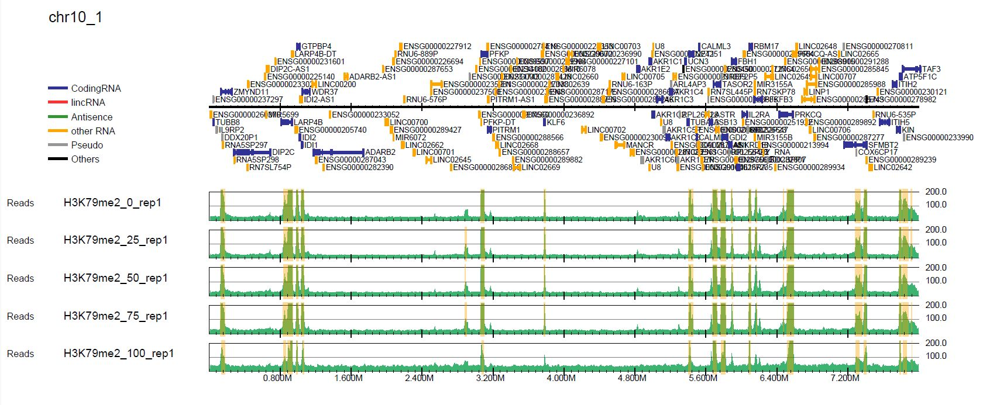
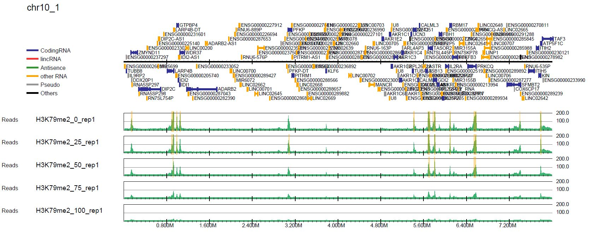
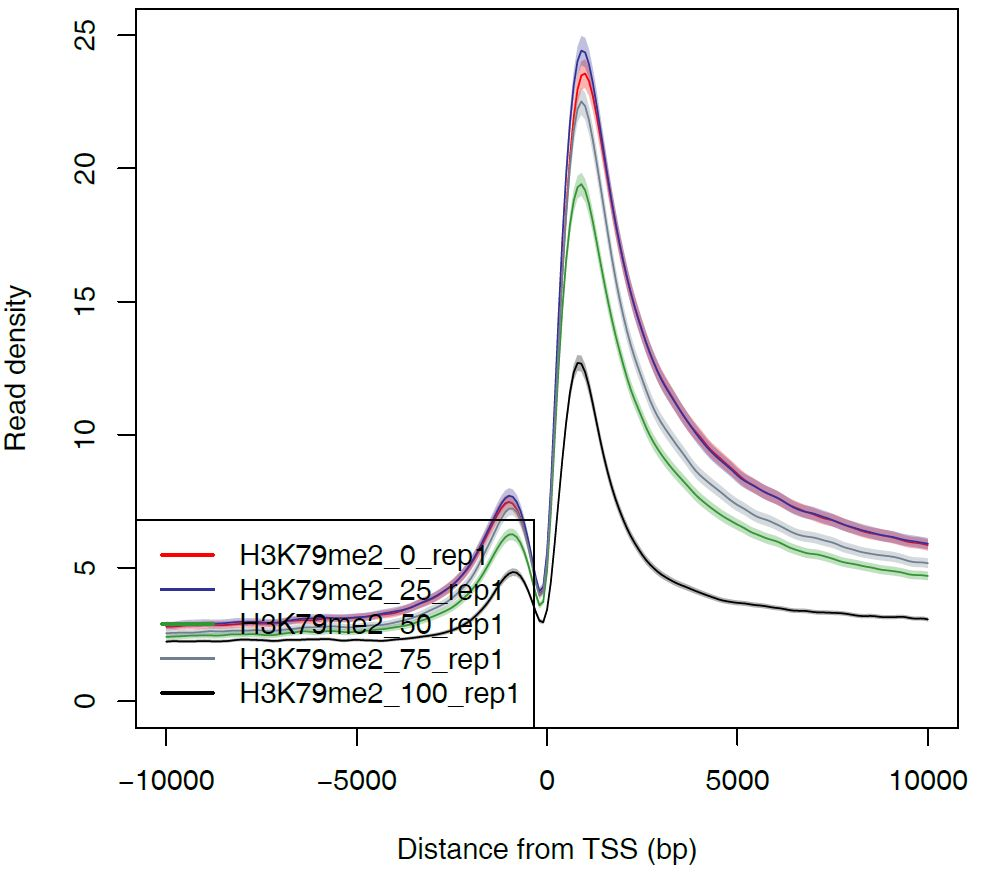

Spike-in analysis (human)
=================================================

Here we show the spike-in analysis using **Churros**.
Spike-in analysis is a method to normalize the ChIP-seq data by adding a known amount of external DNA as an internal control.
This method allows us to compare ChIP-seq samples at an absolute level.

In this tutorial, we will use the ChIP-seq data of H3K79me2 histone modification data for Jurkat cells from `Orlando et al., Cell Reports, 2014 <https://www.cell.com/cell-reports/fulltext/S2211-1247(14)00872-9>`_.
The sample scripts are also available at `Churros GitHub site <https://github.com/rnakato/Churros/tree/main/tutorial/Spikein>`_.

H3K79me2 modification is lost from chromatin by treatment with the DOT1L inhibitor EPZ5676.
In this experiment, EPZ5676-treated cells (low H3K79me2 levels) were mixed with DMSO-treated cells (high H3K79me2 levels) at ratios of 0%, 25%, 50%, 75%, and 100%. Therefore, in the ChIP-seq data, the higher the proportion of EPZ5676-treated cells, the lower the enrichment of H3K79me2 peaks should be.

.. note::

   | This tutorial assumes using the **Churros** singularity image (``churros.sif``). Please add ``singularity exec churros.sif`` before each command below.
   | Example: ``singularity exec churros.sif download_genomedata.sh``

.. contents:: 
   :depth: 3

Get data
------------------------

Here we use `parallel-fastq-dump <https://github.com/rvalieris/parallel-fastq-dump>`_ to download the fastq files from the SRA database.

.. code-block:: bash

    mkdir -p fastq
    for id in SRR1536557 SRR1536558 SRR1536559 SRR1536560 SRR1536561 SRR1584489 SRR1584490 SRR1584491 SRR1584492 SRR1584493
    do
        parallel-fastq-dump --sra-id $id --threads 4 --outdir fastq/ --gzip
    done

Then download and generate the reference dataset including genome, gene annotation and index files.

The reference genome is human, while the spike-in DNA is the D. melanogaster.
Here we specify ``hg38`` and ``dm6`` for genome build.

.. code-block:: bash

    mkdir -p log
    ncore=24
    for build in hg38 dm6
    do
        Ddir=Referencedata_$build
        download_genomedata.sh $build $Ddir 2>&1 | tee log/$Ddir
        build-index.sh -p $ncore bowtie2 $Ddir
    done

Prepare sample list
-------------------------------------

The format of ``samplelist.txt`` and ``samplepairlist.txt`` is the same with `the normal analysis <https://churros.readthedocs.io/en/latest/content/Quickstart.html>`_.

samplelist.txt
++++++++++++++++++++++++++

.. code-block:: bash

    H3K79me2_0_rep1 fastq/SRR1536557.fastq.gz
    H3K79me2_25_rep1        fastq/SRR1536558.fastq.gz
    H3K79me2_50_rep1        fastq/SRR1536559.fastq.gz
    H3K79me2_75_rep1        fastq/SRR1536560.fastq.gz
    H3K79me2_100_rep1       fastq/SRR1536561.fastq.gz
    WCE_0_rep1      fastq/SRR1584489.fastq.gz
    WCE_25_rep1     fastq/SRR1584490.fastq.gz
    WCE_50_rep1     fastq/SRR1584491.fastq.gz
    WCE_75_rep1     fastq/SRR1584492.fastq.gz
    WCE_100_rep1    fastq/SRR1584493.fastq.gz

samplepairlist.txt
++++++++++++++++++++++++++

.. code-block:: bash

    H3K79me2_0_rep1,WCE_0_rep1,H3K79me2_0_rep1,sharp
    H3K79me2_25_rep1,WCE_25_rep1,H3K79me2_25_rep1,sharp
    H3K79me2_50_rep1,WCE_50_rep1,H3K79me2_50_rep1,sharp
    H3K79me2_75_rep1,WCE_75_rep1,H3K79me2_75_rep1,sharp
    H3K79me2_100_rep1,WCE_100_rep1,H3K79me2_100_rep1,sharp

Running Churros
------------------------------------------------

The ``churros`` command has a ``--spikein`` option to run in spike-in mode.
In spike-in mode, in addition to the normal arguments, the genome build and the reference data directory of the spike-in genome should be specified by the ``--build_spikein`` and ``--Ddir_spikein`` options, respectively.

.. code-block:: bash

    ncore=48
    build=hg38
    build_spikein=dm6
    Ddir_ref=Referencedata_$build
    Ddir_spikein=Referencedata_$build_spikein

    churros -p $ncore --spikein samplelist.txt samplepairlist.txt \
        $build $Ddir_ref --build_spikein $build_spikein --Ddir_spikein $Ddir_spikein

The output directory contains several new subdirectories:

- ``spikein_scalingfactor/``: A scaling factor calculated from the number of reads in the spike-in genome. Reads are normalized to this value.
- ``bigWig/Spikein/``: bigWig files that have been spike-in normalized.
- ``pdf_spikein/``: Visualization files that have been spike-in normalized. The ``pdf/`` directory contains visualization files using total read normalization.

.. note::

   Currently, spike-in normalization is not applied to peak calling with MACS2.

Let's look at the read distribution with total read normalization (in the ``pdf/`` directory) and spike-in normalization (in the ``pdf_spikein/`` directory). The first page of chromosome 10 (``drompa+.bin5M.PCSHARP.5000_chr10.pdf``) looks like this.

   Total read normalization

   Spike-in normalization

In the spike-in normalization, we can see the decreased enrichment of H3K79me2, while the total read normalization does not successfully show it.

Generate a read distribution profile
+++++++++++++++++++++++++++++++++++++++++

Churros uses `DROMPAplus <https://drompaplus.readthedocs.io/>`_ internally, which has a command to generate a read distribution profile in the PDF format.
You can use it to see the averaged read distribution for spike-in normalization.

The command for DROMPAplus is as follows. See the `DROMPAplus manual <https://drompaplus.readthedocs.io/en/latest/content/drompa/Profile.html>`_ for details.

.. code-block:: bash

    build=hg38
    Ddir_ref=Referencedata_${build}
    gt=$Ddir_ref/genometable.txt
    gene=$Ddir_ref/gtf_chrUCSC/chr.proteincoding.gene.refFlat

    mkdir -p profile

    pdir=Churros_result_Quickstart/hg38/bigWig/TotalReadNormalized
    s1="-i $pdir/H3K79me2_0_rep1.100.bw,$pdir/WCE_0_rep1.100.bw,H3K79me2_0_rep1"
    s2="-i $pdir/H3K79me2_25_rep1.100.bw,$pdir/WCE_25_rep1.100.bw,H3K79me2_25_rep1"
    s3="-i $pdir/H3K79me2_50_rep1.100.bw,$pdir/WCE_50_rep1.100.bw,H3K79me2_50_rep1"
    s4="-i $pdir/H3K79me2_75_rep1.100.bw,$pdir/WCE_75_rep1.100.bw,H3K79me2_75_rep1"
    s5="-i $pdir/H3K79me2_100_rep1.100.bw,$pdir/WCE_100_rep1.100.bw,H3K79me2_100_rep1"

    $sing drompa+ PROFILE --gt $gt -g $gene $s1 $s2 $s3 $s4 $s5 -o profile/TotalReadNormalized-H3K79me2 --widthfromcenter 10000

    pdir=Churros_result_Quickstart/hg38/bigWig/Spikein
    idir=Churros_result_Quickstart/hg38/bigWig/RawCount
    s1="-i $pdir/H3K79me2_0_rep1.100.bw,$idir/WCE_0_rep1.100.bw,H3K79me2_0_rep1"
    s2="-i $pdir/H3K79me2_25_rep1.100.bw,$idir/WCE_25_rep1.100.bw,H3K79me2_25_rep1"
    s3="-i $pdir/H3K79me2_50_rep1.100.bw,$idir/WCE_50_rep1.100.bw,H3K79me2_50_rep1"
    s4="-i $pdir/H3K79me2_75_rep1.100.bw,$idir/WCE_75_rep1.100.bw,H3K79me2_75_rep1"
    s5="-i $pdir/H3K79me2_100_rep1.100.bw,$idir/WCE_100_rep1.100.bw,H3K79me2_100_rep1"

    $sing drompa+ PROFILE --gt $gt -g $gene $s1 $s2 $s3 $s4 $s5 -o profile/Spikein-H3K79me2 --widthfromcenter 10000

The results are in the ``profile/`` directory.

   Averaged read distribution around TSSs of all protein-coding genes

Execute a single step
------------------------------------

churros_mapping_spikein
+++++++++++++++++++++++++++++++++++++

If you want to run only the mapping step for spike-in normalization, use the ``churros_mapping_spikein`` command.

.. code-block:: bash

    build=hg38
    build_spikein=dm6
    Ddir_ref=Referencedata_${build}
    Ddir_spikein=Referencedata_${build_spikein}
    ncore=48

    churros_mapping_spikein exec samplelist.txt samplepairlist.txt -p ${ncore} \
        ${build} ${build_spikein} \
        ${Ddir_ref} ${Ddir_spikein}

churros_visualize
+++++++++++++++++++++++++++++++++++++

If you want to generate PDF files for spike-in normalization, supply the options to ``churros_visualize`` as follows.

.. code-block:: bash

    build=hg38
    Ddir=Referencedata_$build
    # Spike-in normalization (in the pdf_spikein directory)
    churros_visualize --pdfdir pdf_spikein \
                      --chipdirectory Spikein --inputdirectory TotalReadNormalized \
                      samplepairlist.txt drompa+ $build $Ddir

