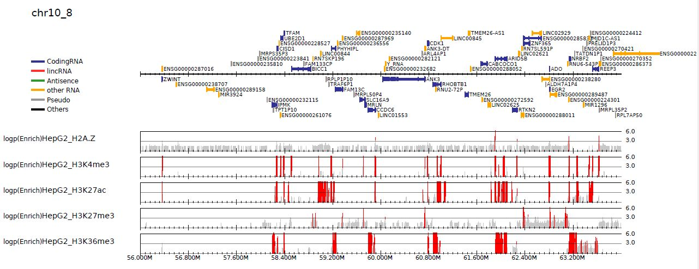
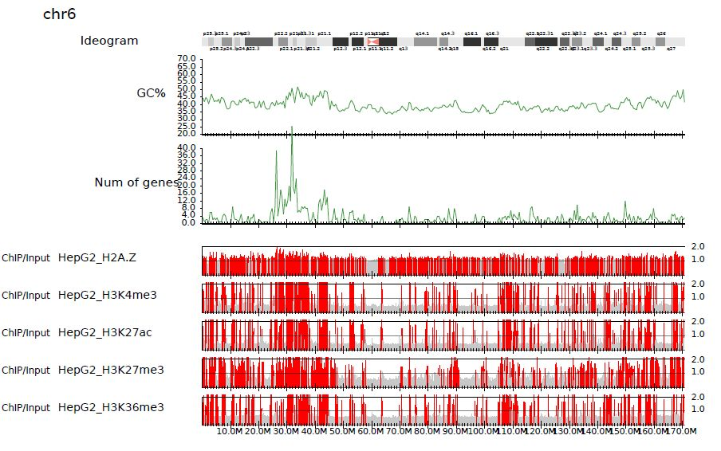
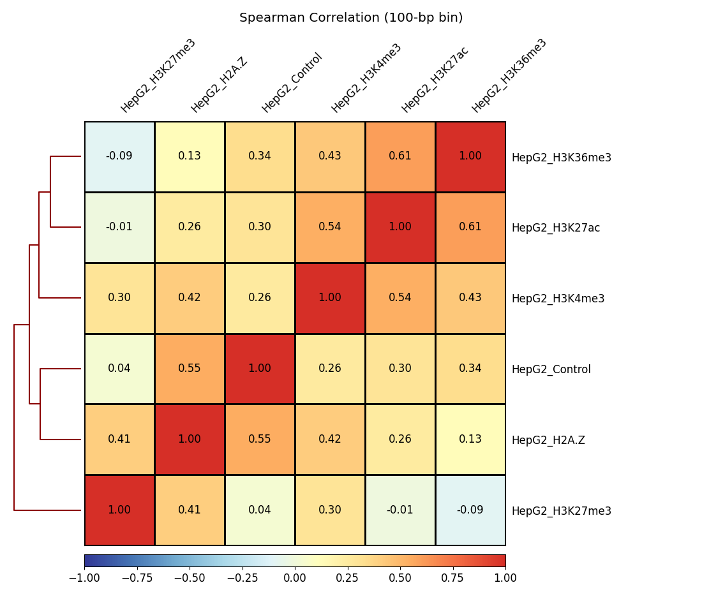
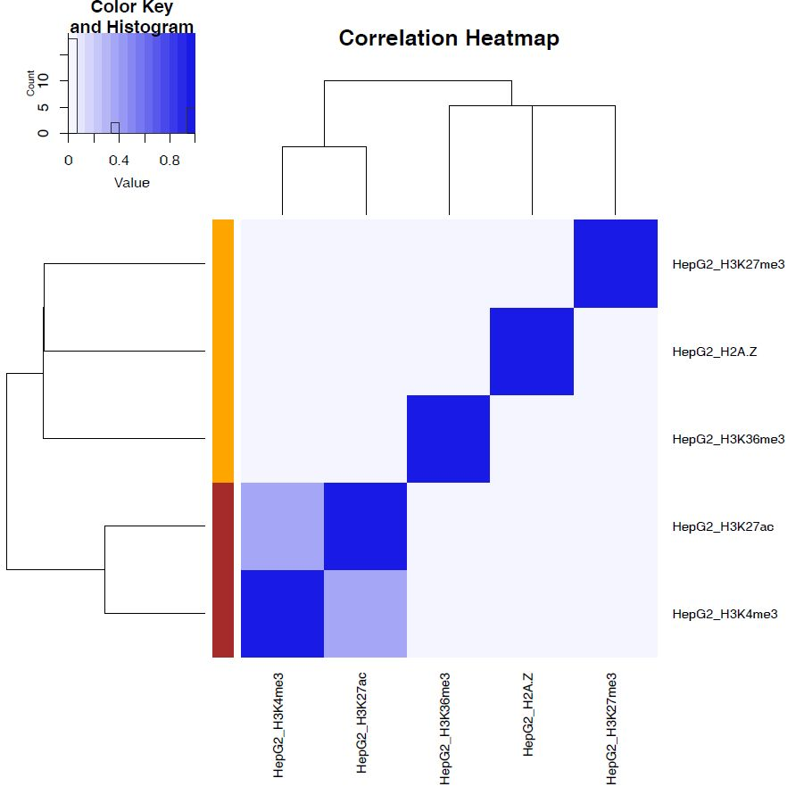

Step-by-step analysis (ChIP-seq, human)
=================================================

Here we show the step-by-step ChIP-seq analysis using **Churros**. See also the sample scripts in the `tutorial <https://github.com/rnakato/Churros/tree/main/tutorial/human>`_ on GitHub.

.. note::

   | This tutorial assumes using the **Churros** singularity image (``churros.sif``). Please add ``singularity exec churros.sif`` before each command below.
   | Example: ``singularity exec churros.sif download_genomedata.sh``


.. contents:: 
   :depth: 3


Prepare sample list
-------------------------------------

``samplelist.txt`` is a **tab-delimited** file (TSV) that describes the sample labels and the path to the corresponding fastq files.

.. code-block:: bash

    HepG2_H2A.Z     fastq/SRR227639.fastq.gz
    HepG2_H3K4me3   fastq/SRR227563.fastq.gz
    HepG2_H3K27ac   fastq/SRR227575.fastq.gz
    HepG2_H3K27me3  fastq/SRR227598.fastq.gz
    HepG2_H3K36me3  fastq/SRR227447.fastq.gz
    HepG2_Control   fastq/SRR227552.fastq.gz

**Churros** has a script `gen_samplelist.sh <https://churros.readthedocs.io/en/latest/content/Commands.html#utility-tools>`_ to make the initial samplelist.txt.

.. code-block:: bash

    gen_samplelist.sh fastq/ > samplelist.txt


When using paired-end fastqs, use the second and the third columns to specify the R1 (F3) and R2 (F5) fastqs like this: 

.. code-block:: bash

    HepG2_H2A.Z     fastq/SRR227639_1.fastq.gz  fastq/SRR227639_2.fastq.gz
    HepG2_H3K4me3   fastq/SRR227563_1.fastq.gz  fastq/SRR227563_2.fastq.gz
    HepG2_H3K27ac   fastq/SRR227575_1.fastq.gz  fastq/SRR227575_2.fastq.gz
    HepG2_H3K27me3  fastq/SRR227598_1.fastq.gz  fastq/SRR227598_2.fastq.gz
    HepG2_H3K36me3  fastq/SRR227447_1.fastq.gz  fastq/SRR227447_2.fastq.gz
    HepG2_Control   fastq/SRR227552_1.fastq.gz  fastq/SRR227552_2.fastq.gz

`gen_samplelist.sh -p <https://churros.readthedocs.io/en/latest/content/Commands.html#utility-tools>`_ makes the samplelist.txt for paired-end samples.

.. code-block:: bash

    gen_samplelist.sh -p fastq/ > samplelist.txt


Sample list with BAM files
+++++++++++++++++++++++++++++++++

Starting with ``version 1.3.0``, **Churros** can allow BAM files as input in samplelist.txt instead of FASTQ files. Just replace the FASTQ entries with BAM files like this:

.. code-block:: bash

    HepG2_H2A.Z     bam/HepG2_H2A.Z.sort.bam
    HepG2_H3K4me3   bam/HepG2_H3K4me3.sort.bam
    HepG2_H3K27ac   bam/HepG2_H3K27ac.sort.bam
    HepG2_H3K27me3  bam/HepG2_H3K27me3.sort.bam
    HepG2_H3K36me3  bam/HepG2_H3K36me3.sort.bam
    HepG2_Control   bam/HepG2_Control.sort.bam

SAM (.sam), BAM (.bam) and CRAM (.cram) formats are acceptable. For paired-end map files, specify the ``--pair`` option to ``churros``.

.. note::

   - Sample lists that contain both BAM and FASTQ files will not be accepted.
   - BAM files are only accepted in normal mode. The spike-in mode (``--spikein``) does not allow BAM files as input.

Prepare sample pair list
-------------------------------------

``samplepairlist.txt`` is a **comma-delimited** file (CSV) that describes the ChIP/Input pairs as follows:

- ChIP-sample label
- Input-sample label
- prefix
- peak mode

.. code-block:: bash

    HepG2_H2A.Z,HepG2_Control,HepG2_H2A.Z,sharp
    HepG2_H3K4me3,HepG2_Control,HepG2_H3K4me3,sharp
    HepG2_H3K27ac,HepG2_Control,HepG2_H3K27ac,sharp
    HepG2_H3K27me3,HepG2_Control,HepG2_H3K27me3,broad
    HepG2_H3K36me3,HepG2_Control,HepG2_H3K36me3,broad


ChIP and input sample labels should be identical to those in ``samplelist.txt``.
``prefix`` is used for the output files.
``peak mode`` is either ``[sharp|broad|sharp-nomodel|broad-nomodel]``. This parameter is used for peak calling by `MACS2 <https://github.com/macs3-project/MACS>`_.

Input samples can be omitted if unavailable.

.. code-block:: bash

    HepG2_H2A.Z,,HepG2_H2A.Z,sharp
    HepG2_H3K4me3,,HepG2_H3K4me3,sharp
    HepG2_H3K27ac,,HepG2_H3K27ac,sharp
    HepG2_H3K27me3,,HepG2_H3K27me3,broad
    HepG2_H3K36me3,,HepG2_H3K36me3,broad


In addition, **Churros** also has a script `gen_samplepairlist.sh <https://churros.readthedocs.io/en/latest/content/Commands.html#utility-tools>`_ to make the initial template of samplepairlist.txt.

.. code-block:: bash

    gen_samplepairlist.sh samplelist.txt > samplepairlist.txt


churros_mapping: mapping reads
--------------------------------------------------

``churros_mapping`` takes FASTQ and maps reads to the genome specified by Bowtie2 by default.
The mapped reads are then quality-checked and converted to BigWig files.

.. code-block:: bash

    build=hg38
    Ddir=Referencedata_hg38

    # mapping
    $sing churros_mapping -p 12 exec samplelist.txt $build $Ddir

    # output QC stats
    $sing churros_mapping header samplelist.txt $build $Ddir > churros.QCstats.tsv
    $sing churros_mapping stats samplelist.txt $build $Ddir >> churros.QCstats.tsv

- Output
    - bam/    ... map files (BAM format in default) and index files
    - sspout/ ... output of SSP (strand-shift profile) for quality check
    - bigWig/ ... bigWig files (100 bp, 5 kbp and 100 kbp bins by default) with raw count (``RawCount``) and total read normalization (``TotalReadNormalized``)
    - log/ ... log files


checkQC.py: Quality check of the input samples
--------------------------------------------------

Quality check (QC) is an important step in verifying the reliability of the results obtained.
From verion ``0.11.0``. **Churros** provides a script ``checkQC.py`` to check the quality of all input samples.

.. code-block:: bash

    build=hg38
    checkQC.py Churros_result/$build/churros.QCstats.tsv samplepairlist.txt

If the samples do not meet the criteria, the script will output a warning message.

See the `checkQC.py: check the quality of the input ChIP-seq samples <https://churros.readthedocs.io/en/latest/content/Commands.html#checkqc-py-check-the-quality-of-the-input-chip-seq-samples>`_ page for the detailed criteria.

churros_callpeak: call peaks by MACS2
--------------------------------------------------

``churros_callpeak`` calls peaks of the samples specified in ``samplepairlist.txt`` using `MACS2 <https://github.com/macs3-project/MACS>`_.
If input samples are omitted, peaks are called using ChIP samples only.

By default, the ``churros`` command does not include this step. Add the ``--callpeak`` option to include this step in ``churros``.

.. note::

   Starting with version 1.4.0, the option of ``churros_callpeak`` to specify the number of CPUs has been changed from ``-p`` to ``-t`` to add a new parameter ``-p (paired-end mode)``.

.. code-block:: bash

    churros_callpeak -t 8 samplepairlist.txt hg38

``churros_callpeak`` also outputs the correlation scores (Simpson index) and heatmaps.

- Output
    - macs/ ... peak files called by MACS2. The log files are stored in \*log. ``samplepairlist.txt`` in ``macs/`` directory includes the filename of peak files that is used in ``churros_visualize``.


churros_visualize: visualize read distributions by DROMPA+
--------------------------------------------------------------------

``churros_visualize`` visualizes the distribution of raw reads, ChIP/Input enrichment and ChIP/Input p-value in PDF format.
The pdf files and corresponding peak lists are generated in ``pdf/``.

.. code-block:: bash

    churros_visualize samplepairlist.txt drompa+ hg38 Referencedata_hg38

To specify binsize 5-kbp, supply ``-b 5000``. ``-l 8000`` means the line size for each page is 8-Mbp. ``-P "--scale_tag 100"`` indicates the scale of y-axis is 100.

.. code-block:: bash

    churros_visualize -b 5000 -l 8000 -P "--scale_tag 100" samplepairlist.txt \
      drompa+.bin5M hg38 Referencedata_hg38

Highlight peak regions
+++++++++++++++++++++++++++++++++

| ``churros_visualize`` can highlight peak regions if the peak file is specified in ``samplepairlist.txt``.
| (i.e., the column of ``samplepairlist.txt`` for ``churros_visualize`` is ``<ChIP-sample>,<Input-sample>,<prefix>,<peakfile>``).
| Because ``churros_callpeak`` generated ``Churros_result/$build/macs/samplepairlist.txt`` that includes the peak files, ``churros_visualize`` highlights the peak regions by the command below:

.. code-block:: bash

    samplepairlist=Churros_result/hg38/macs/samplepairlist.txt
    churros_visualize $samplepairlist drompa+.macspeak hg38 Referencedata_hg38

.. figure:: img/Visualize_read.jpg
   :width: 700px
   :align: center
   :alt: Alternate

   Read distribution with peak highlighting


Visualize p-value distribution
+++++++++++++++++++++++++++++++++++++++

Supply ``--pvalue`` option to visualize -log10(p) distribution of ChIP/input enrichment, which is recommended by `ROADMAP project <https://www.nature.com/articles/nature14248>`_ to distinguish the signal from the noise.

.. code-block:: bash

    churros_visualize --pvalue -b 5000 -l 8000 \
        samplepairlist.txt drompa+.pval.bin5M hg38 Referencedata_hg38



   -log10(p) distribution (ChIP/Input)


Chromosome-wide view
+++++++++++++++++++++++++++++++++

To visualize genome-wide view, supply ``-G`` option.

.. code-block:: bash

    churros_visualize -G samplepairlist.txt drompa+ hg38 Referencedata_hg38



   Chromosome-wide distribution (ChIP/Input enrichment)


Modify parameter sets for visualization manually
++++++++++++++++++++++++++++++++++++++++++++++++++++++++++++++++++++++++++++++

``churros_visualize`` also outputs a log file of pdf files generation
(e.g., ```Churros_result/$build/log/pdf/drompa+.PCSHARP.100.log`` for ``Churros_result/$build/pdf/drompa+.PCSHARP.100.*.pdf``).
This log file contains the command of DROMPA+ to make the pdf file at the top.

.. code-block:: bash

    head -n1 Churros_result/$build/log/pdf/drompa+.PCSHARP.100.log

The output will look like this:

.. code-block:: bash

    drompa+ PC_SHARP --ls 1000 -g Referencedata_hg38/gtf_chrUCSC/chr.gene.refFlat \
    --gt Referencedata_hg38/genometable.txt --callpeak --showchr \
    -i Churros_result/parse2wigdir+/HepG2_H2A.Z-bowtie2-hg38-raw-mpbl-GR.100.bw,Churros_result/parse2wigdir+/HepG2_Control-bowtie2-hg38-raw-mpbl-GR.100.bw,HepG2_H2A.Z, \
    -i Churros_result/parse2wigdir+/HepG2_H3K4me3-bowtie2-hg38-raw-mpbl-GR.100.bw,Churros_result/parse2wigdir+/HepG2_Control-bowtie2-hg38-raw-mpbl-GR.100.bw,HepG2_H3K4me3, \
    -i Churros_result/parse2wigdir+/HepG2_H3K27ac-bowtie2-hg38-raw-mpbl-GR.100.bw,Churros_result/parse2wigdir+/HepG2_Control-bowtie2-hg38-raw-mpbl-GR.100.bw,HepG2_H3K27ac, \
    -i Churros_result/parse2wigdir+/HepG2_H3K27me3-bowtie2-hg38-raw-mpbl-GR.100.bw,Churros_result/parse2wigdir+/HepG2_Control-bowtie2-hg38-raw-mpbl-GR.100.bw,HepG2_H3K27me3, \
    -i Churros_result/parse2wigdir+/HepG2_H3K36me3-bowtie2-hg38-raw-mpbl-GR.100.bw,Churros_result/parse2wigdir+/HepG2_Control-bowtie2-hg38-raw-mpbl-GR.100.bw,HepG2_H3K36me3, \
    -o Churros_result/pdf/drompa+.PCSHARP.100 \
    | tee -a Churros_result/pdf/drompa+.PCSHARP.100.log

Therefore, you can modify the resulting pdf files by directly modifying this command and ``-o`` option that specifies the output name.
For example, if you want to change the y-axis scale to 50, add ``--scale_tag 50`` and execute:

.. code-block:: bash

    drompa+ PC_SHARP --scale_tag 50 --ls 1000 (...) \
    -o Churros_result/pdf/drompa+.PCSHARP.100.modified

See `DROMPAplus manual <https://drompaplus.readthedocs.io/en/latest/index.html>`_ for the detailed usage of DROMPA+.


churros_compare: compare peaks among ChIP samples
--------------------------------------------------------------------

``churros_compare`` outputs the heatmap of the correlation of peaks between ChIP samples.
The results are output to the ``comparsion/`` directory. 

.. note::

   By default, the ``churros`` command does not include this step because the computation time becomes long when the number of samples is quite large. Add the ``--comparative`` option to include this step in ``churros``.

It the number of peaks largely varies among samples, the comparison may become unfair. Therefore ``churros_compare`` also estimates peak overlap for 'top-ranked 2000 peaks'.

.. code-block:: bash

    churros_compare samplelist.txt samplepairlist.txt hg38

- The results include three types of comparisons.
    - ``bigwigCorrelation/`` ... Spearman correlation of read distributions in 100 bp and 100 kbp bins from `deepTools plotCorrelation <https://deeptools.readthedocs.io/en/develop/content/tools/plotCorrelation.html>`_. This score evaluates the similarity of the entire genome including non-peak regions. Therefore, the results may reflect the genome-wide features (e.g., GC bias and copy number variation) rather than peak overlap.
    - ``Peak_BPlevel_overlap/`` ... results of the base-pair level overlap of peaks (Jaccard index) using `BEDtools jaccard <https://bedtools.readthedocs.io/en/latest/content/tools/jaccard.html>`_. This score is good for broad peaks such as some histone modifications (H3K27me3 and H3K36me3).
    - ``Peak_Number_overlap/`` ... results of peak-number level comparison (Simpson index). ``PairwiseComparison/`` contains the results of all pairs (overlapped peak list and Venn diagram) and the ``Peaks`` contains the top-ranked peaks of samples. This score is good for comparing sharp peaks such as transcription factors.




   bigwigCorrelation



   Peak_Number_overlap

churros_genPvalwig: generate P-value distribution as bedGraph
--------------------------------------------------------------------

``churros_genPvalwig`` generates a -log10(P-value) distribution in bedGraph format. The P-value of upregulation and downregulation is output separately. This bedGraph file is suitable for the ChIP-seq imputation. The results are output in ``drompa+.pval/``.

.. note::

   By default, the ``churros`` command does not include this step. Add the ``--outputpvalue`` option to include this step in ``churros``.

.. code-block:: bash

    Ddir=Referencedata_hg38
    gt=$Ddir/genometable.txt
    churros_genPvalwig samplepairlist.txt drompa+.pval hg38 $gt
