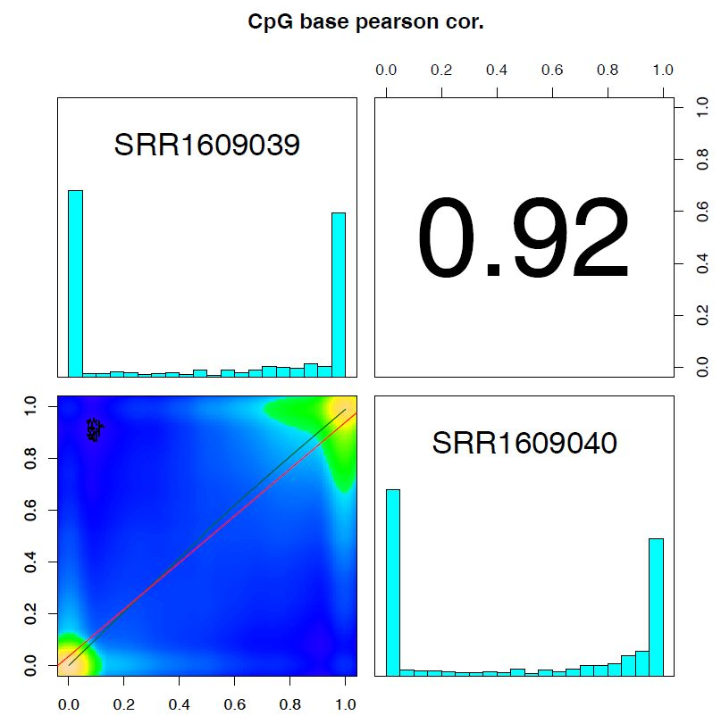

DNA methylation analysis
===========================================

This page describes how to analyze Bisulfite sequencing data for DNA methylation analysis with **Churros**.
Churros includes `Bismark <https://www.bioinformatics.babraham.ac.uk/projects/bismark/>`_ to handle Bisulfite sequencing data.
The sample scripts are also available at `Churros GitHub site <https://github.com/rnakato/Churros/tree/main/tutorial/05.DNAmethylation>`_.

.. note::

   | This tutorial assumes using the **Churros** singularity image (``churros.sif``). Please add ``apptainer exec churros.sif`` before each command below.
   | Example: ``apptainer exec churros.sif download_genomedata.sh``

.. contents:: 
   :depth: 3

Get data
------------------------

Here we use two human RRBS data.

.. code-block:: bash

    mkdir -p fastq
    for id in SRR1609039 SRR1609040
    do
        fastq-dump --split-files --gzip $id -O fastq
    done

| Then download and generate the reference dataset including genome, gene annotation and index files. **Chuross** contains scripts for that: ``download_genomedata.sh`` and ``build-index.sh``.
| Here we specify ``hg38`` for genome build. See :doc:`Appendix` for the detail of genome build.

.. code-block:: bash

    mkdir -p log
    build=hg38      # genome build
    Ddir=Referencedata_$build   # output directory
    ncore=12    # number of CPUs
    # download the genome
    download_genomedata.sh -s $build $Ddir
    # make Bismark index
    build-index.sh -p $ncore bismark $Ddir

Running Bismark
------------------------------------------------

**Bismark.sh** command executes all steps of Bismark as follows:

    - ``bismark (mapping)``
    - ``deduplicate_bismark``
    - ``bismark_methylation_extractor``
    - ``bismark2report``
    - ``bismark2summary``

In addition, **Bismark.sh** executes `MultiQC <https://multiqc.info/>`_ to make a summary of quality statistics.

Supply ``-m`` option to specify the mode of Bisulfite sequencing (``[directional|non_directional|pbat|rrbs]``).
Because here we use a RRBS sample, ``-m rrbs`` option is supplied.

.. code-block:: bash

    index=Referencedata_hg38/bismark-indexes_genome
    ncore=24

    Bismark.sh -p $ncore -m rrbs $index fastq/SRR1609039.fastq.gz
    Bismark.sh -p $ncore -m rrbs $index fastq/SRR1609040.fastq.gz

The results are output in ``Bismarkdir/``. If you want to specify the name of the output directory, use ``-d`` option.

- Output
    - \*_bismark_bt2.bam ... Map file by ``bismark`` (BAM format)
    - [CpG|CHG|CHH]_context_\*_bismark_bt2.txt.gz ... Output of ``bismark_methylation_extractor``. Context-dependent (CpG/CHG/CHH) methylation.
    - \*_bismark_bt2.bedGraph.gz ... Bedgraph-format methylation information
    - \*_bismark_bt2.bismark.cov.gz ... Coverage file including counts methylated and unmethylated residues
    - \*_bismark_bt2_\*_report.html ... Output of ``bismark2report``. Reports of Bismark alignment, deduplication and methylation extraction (splitting). `Example <https://www.bioinformatics.babraham.ac.uk/projects/bismark/PE_report.html>`_
    - bismark_summary_report.html ... Output of ``bismark2summary``. Summary of multiple Bismark data. `Example <https://www.bioinformatics.babraham.ac.uk/projects/bismark/bismark_summary_WGBS.html>`_
    - multiqc_report.html ... Output of MultiQC

See `Bismark User Guide <https://rawgit.com/FelixKrueger/Bismark/master/Docs/Bismark_User_Guide.html>`_ for more detail.

Methylkit for differential analysis
------------------------------------------------

You can then conduct differential analysis using `methylKit <https://github.com/al2na/methylKit>`_.
This is a sample R script.

.. code-block:: r

    library(methylKit)

    files <- list("Bismarkdir/SRR1609039_trimmed_bismark_bt2.sorted.bam", 
                  "Bismarkdir/SRR1609040_trimmed_bismark_bt2.sorted.bam"
                  )

    sample.id <- list("SRR1609039", "SRR1609040")

    myobj=processBismarkAln(location = files,　
                                    sample.id=sample.id,
                                    assembly="hg38",
                                    read.context="CpG",
                                    mincov = 4,
                                    treatment=c(0,1),
                                    save.folder=getwd()
                                    )

    if (!dir.exists("methylKit")){
            dir.create("methylKit")
    }

    pdf("methylKit/methyl_stats.pdf")
    getMethylationStats(myobj[[1]],plot=TRUE,both.strands=FALSE)
    dev.off()

    pdf("methylKit/coverage_stats.pdf")
    getCoverageStats(myobj[[2]],plot=TRUE,both.strands=FALSE)
    dev.off()

    meth=unite(myobj, destrand=FALSE)

    pdf("methylKit/getCorrelation.pdf")
    getCorrelation(meth,plot=TRUE)
    dev.off()

    pdf("methylKit/clusterSamples.pdf")
    clusterSamples(meth, dist="correlation", method="ward", plot=TRUE)
    dev.off()

    pdf("methylKit/clusterSamples.pdf")
    PCASamples(meth, screeplot=TRUE)
    PCASamples(meth)
    dev.off()

    myDiff=calculateDiffMeth(meth, mc.cores=2)

   getCorrelation.pdf
