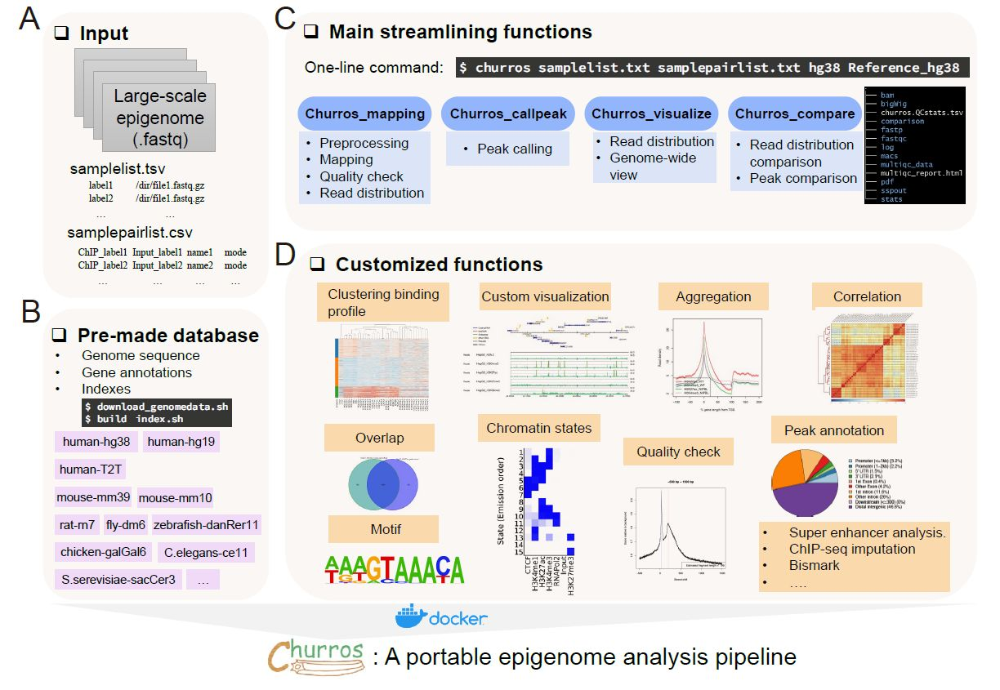

================================================================
Churros
================================================================

**Churros** is a Docker-based epigenomics analysis pipeline.
While **Churros** mainly focuses on the ChIP-seq analysis, it can also handle CUT&TAG, ATAC-seq and DNA methylation data.

Contents:
---------------

.. toctree::
   :numbered:
   :glob:
   :maxdepth: 1

   content/Install
   content/Tutorial.human
   content/Tutorial.scer
   content/StepbyStep
   content/Spikein
   content/Peakheatmap
   content/Tutorial.Bisulfite
   content/Tutorial.ATACseq
   content/Tutorial.CUTTag
   content/Commands

Citation:
--------------

* Wang J, Nakato R, Churros: a Docker-based pipeline for large-scale epigenomic analysis, *DNA Research*, 2023. doi: 10.1093/dnares/dsad026
